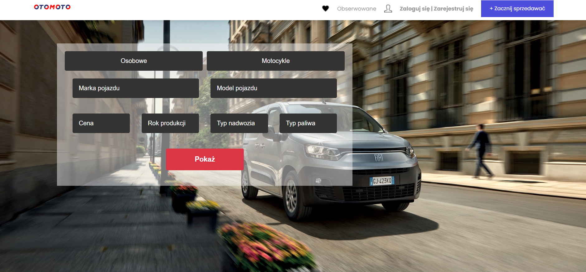
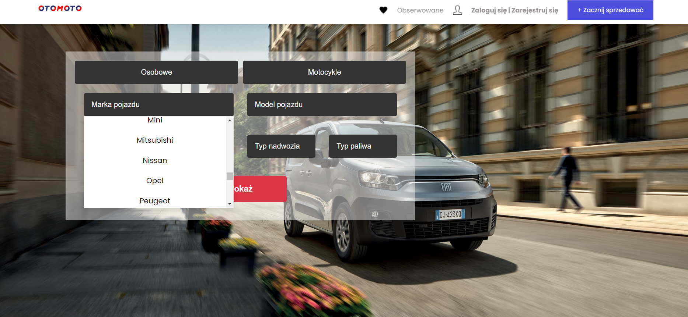
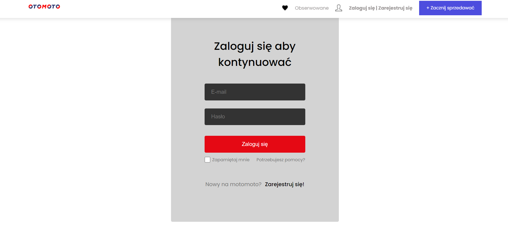
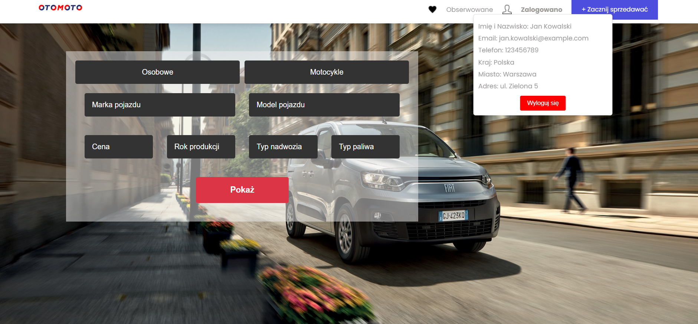
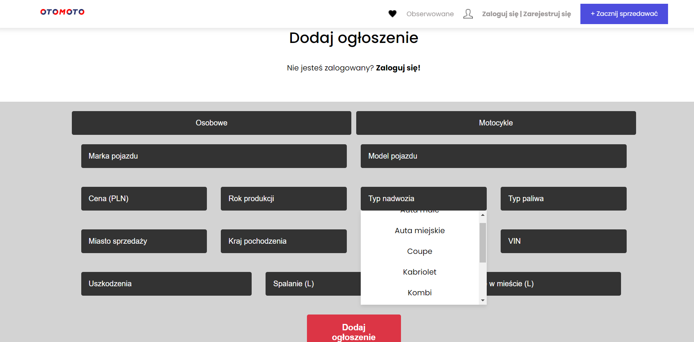
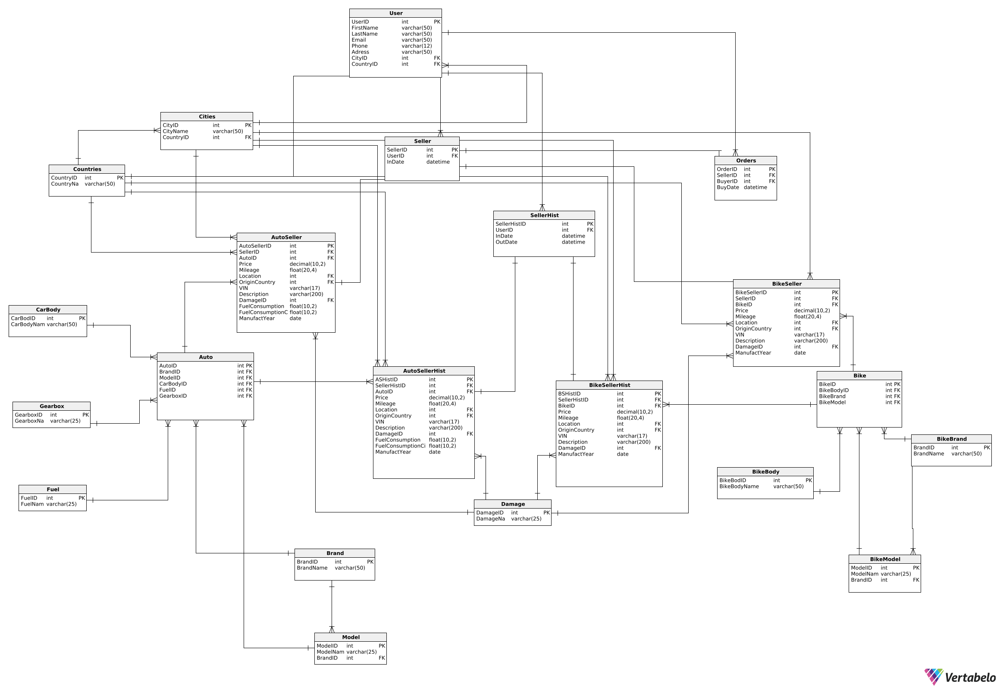

# Project otomoto-clone

## Cel Projektu
Celem projektu było stworzenie funkcjonalnej strony internetowej typu Otomoto, która umożliwi użytkownikom przeglądanie, dodawanie oraz zarządzanie ogłoszeniami motoryzacyjnymi. Strona zawiera zarówno część frontendową (wizualną), jak i backendową (serwer, baza danych), umożliwiając pełną interakcję użytkowników z systemem.

## Funkcjonalność
* **Przeglądanie ogłoszeń:** Użytkownicy mogą przeglądać dostępne ogłoszenia z możliwością filtrowania według różnych kryteriów, takich jak marka, model, rok produkcji, cena, czy lokalizacja.
* **Rejestracja i logowanie:** System obsługuje rejestrację nowych użytkowników oraz logowanie dla istniejących użytkowników z wykorzystaniem hasła.
* **Dodawanie ogłoszeń:** Zarejestrowani użytkownicy będą mieli możliwość dodawania swoich ogłoszeń, w tym zdjęć, opisu pojazdu oraz danych kontaktowych.
* **Zarządzanie ogłoszeniami:** Użytkownicy będą mogli edytować i usuwać swoje ogłoszenia.
* **Panel administracyjny:** Administratorzy strony będą mieli dostęp do panelu, w którym będą mogli zarządzać użytkownikami i ogłoszeniami.

## Technologie

### Frontend:
* **React.js:** Biblioteka JavaScript do budowy interaktywnych interfejsów użytkownika.
* **React Router:** Do zarządzania routowaniem w aplikacji SPA (Single Page Application).
* **HTML5 i CSS3:** Do tworzenia struktury i stylów strony.

### Backend:
* **Node.js:** Środowisko uruchomieniowe JavaScript do budowy serwera aplikacji.
* **Express.js:** Framework webowy dla Node.js, służący do tworzenia API i obsługi zapytań HTTP.
* **MySQL:** Relacyjna baza danych do przechowywania danych o użytkownikach, ogłoszeniach, markach pojazdów, itp.
* **Cors:** Middleware do obsługi Cross-Origin Resource Sharing (CORS), umożliwiający komunikację między frontendem a backendem.

### Inne:
* **Session Management:** Zarządzanie sesjami użytkowników za pomocą express-session.
* **Cookie Parser:** Middleware do parsowania ciasteczek HTTP.

## Przyszłe Rozszerzenia
* **System Recenzji:** Dodanie systemu recenzji i ocen dla użytkowników i ogłoszeń.
* **Integracja Płatności:** Dodanie opcji płatności online dla transakcji.
* **Zaawansowane Filtrowanie:** Rozbudowa opcji filtrowania ogłoszeń.

## Wygląd stony

### Główna strona:

Opcje filtrowania wyświetlane z bazy danych:

### Logowanie:

Po kliknięciu w przycisk zarejestruj się, następuje przeniesienie do analogicznej 
strony z rozszerzonymi polami.

Po poprawnym zalogowaniu lub zarejestrowaniu, po kliknięciu w przycisk zaloguj na navbar:

### Sprzedaż:

Po kliknięciu w przycisk zacznij sprzedawać:

### Schemat bazy danych z vertabelo:

